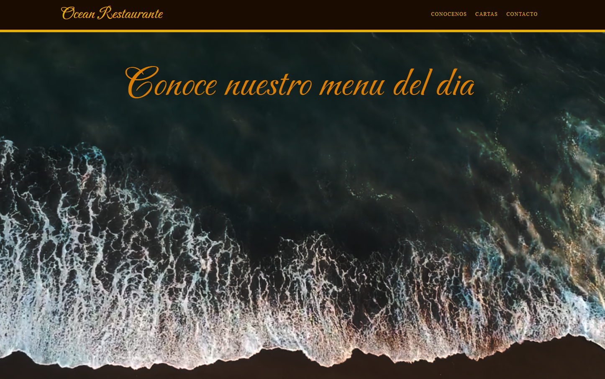
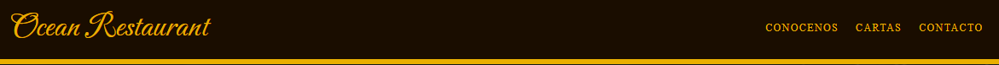
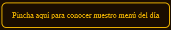
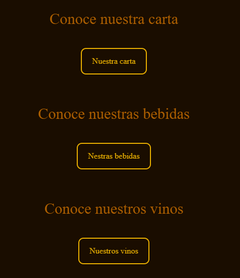

# Ocean Restaurant
<<<<<<< HEAD
***
__Este proyecto se ha basado en la creación de una página web para un restaurante de lujo con temática oceánica. El objetivo de la página es transmitir la información requerida por el cliente de una forma sobria y concisa transmitiendo sencillez y elegancia.__

## Proyecto
***
=======
__Este proyecto se ha basado en la creación de una página web para un restaurante de lujo con temática oceánica. El objetivo de la página es transmitir la información requerida por el cliente de una forma sobria y concisa transmitiendo sencillez y elegancia.__

## Proyecto
>>>>>>> 4076f33186f57579a0a8d9a45d97244778b2e7af
__Este proyecto ha sido creado por Abraham Gálvez Vives haciendo uso de HTML y CSS para crear una web compuesta de tres páginas responsivas que se adapte tanto a PC como a dispositivos móviles.__
## Tecnologías
* [HTML](https://es.wikipedia.org/wiki/HTML)
* [CSS](https://es.wikipedia.org/wiki/CSS)
* [VS CODE](https://es.wikipedia.org/wiki/Visual_Studio_Code)
## Características de la pagina
<<<<<<< HEAD
***

* La página dispone un header desde el cual podrás acceder a cualquiera de las tres páginas o bien acceder a la página principal presionando las letras del nombre del restaurante.

* También dispone de botones en su parte inferior que te enlazan directamente a la siguiente hoja.

* Dentro de la página carta se encuentran tres botones /carta/ bebidas/ vinos/ que te conducirán a sus respectivos PDF.

* En la página de contactos se encuentra un mapa con la ubicación del restaurante.
* Los distintos elementos de la pantalla se adaptan al ancho de la pantalla
## Funcionalidad a desarrollar en un futuro
***
* Cuando el ancho de la pantalla tiene una cantidad de píxeles inferior a 576 el header elimina los píxeles para crear un logotipo de menú. En un futuro se debe implementar el despliegue de los diferentes enlaces a la página. 
## Derechos de propiedad intelectual
***
* Video usado en las pantallas de inicio pretenece a [@javlemus](https://pixabay.com/es/videos/mar-oceano-onda-playa-azul-24216/)
* El botón usado en el header pertenece a
####Colores usados
* Background-color :#1a0d00
* Letras header,button ,H1, H2, P:rgb(233, 175, 0)
* Li, A:rgb(175, 96, 0)

 
=======

* La página dispone un header desde el cual podrás acceder a cualquiera de las tres páginas o bien acceder a la página principal presionando las letras del nombre del restaurante.
* También dispone de botones en su parte inferior que te enlazan directamente a la siguiente hoja.
* Dentro de la página carta se encuentran tres botones /carta/ bebidas/ vinos/ que te conducirán a sus respectivos PDF.
* En la página de contactos se encuentra un mapa con la ubicación del restaurante.
* Los distintos elementos de la pantalla se adaptan al ancho de la pantalla
## Funcionalidad a desarrollar en un futuro
* Cuando el ancho de la pantalla tiene una cantidad de píxeles inferior a 576 el header elimina los píxeles para crear un logotipo de menú. En un futuro se debe implementar el despliegue de los diferentes enlaces a la página. 
## Derechos de propiedad intelectual
* Video usado en las pantallas de inicio pretenece a [@javlemus](https://pixabay.com/es/videos/mar-oceano-onda-playa-azul-24216/)
* [El botón usado en el header pertenece a](https://iconos8.es/icons/set/menu)

>>>>>>> 4076f33186f57579a0a8d9a45d97244778b2e7af
